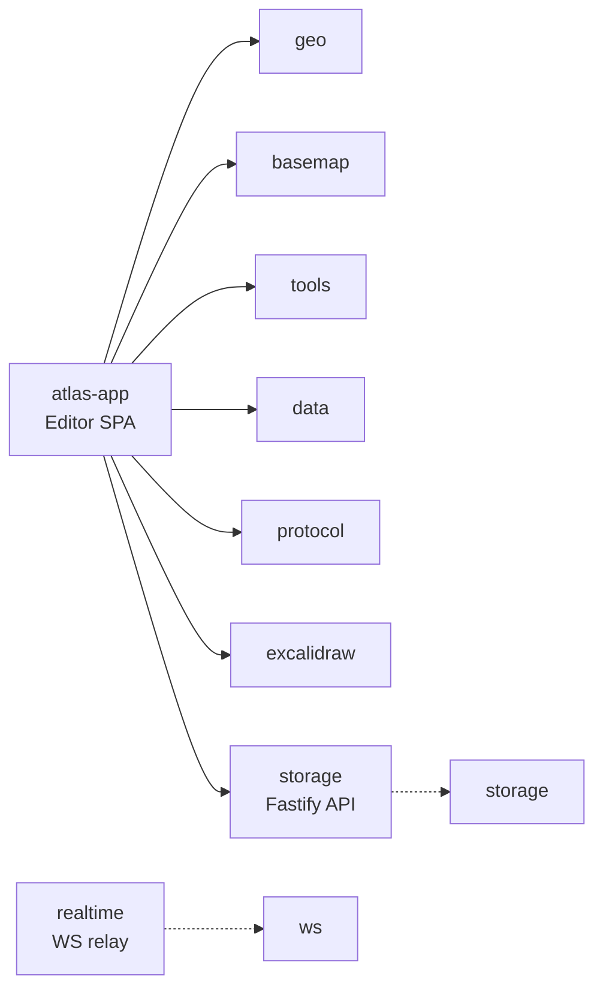

# Atlasdraw

An open-source, self-hostable, real-time collaborative web map studio.
Atlasdraw stacks an [Excalidraw](https://github.com/excalidraw/excalidraw)
drawing surface on top of a [MapLibre GL JS](https://maplibre.org/) basemap
so that hand-drawn annotations stay geographically anchored under pan,
zoom, and collaborative editing.

> [!NOTE]
> **Status:** `v1.0.0` — released 2026-05-15. See [`CHANGELOG.md`](CHANGELOG.md).

## Why Atlasdraw?

You need a map where you can sketch, annotate, and collaborate — not just
drop pins. Atlasdraw gives you a full drawing toolkit on a real GIS basemap.
Annotations reproject on every camera move. Everything stays where you drew it.

- **Drawing meets GIS.** Freehand, polygons, routes, text — all geo-anchored.
- **Self-host first.** Runs offline against a bundled PMTiles basemap. No calls home.
- **Real-time collaboration.** CRDT-backed with cursor presence and anchored comments.
- **Open data I/O.** Import GeoJSON, CSV, Shapefile. Export PNG, PDF, GeoJSON, `.atlasdraw`.

## Quick start

The monorepo lives under [`code/`](code/) and uses Yarn workspaces
(`yarn@1.22`). Node >= 18.

```bash
cd code
yarn install
yarn --cwd apps/atlas-app dev          # editor on http://localhost:5173
```

## Self-host

Two compose stacks in [`infra/`](infra/):

- [`infra/docker-compose.minimal.yml`](infra/docker-compose.minimal.yml) —
  2 services (`web` + `storage` in `sqlite-fs` mode). Bundled PMTiles basemap.
  No outbound network calls in the default config.
- [`infra/docker-compose.yml`](infra/docker-compose.yml) — full stack:
  `web` + `storage` (postgres-minio mode) + `postgres` + `minio` + `caddy`.
  Realtime service available via the `realtime` compose profile.

Minimal first run: [`docs/self-host/README.md`](docs/self-host/README.md).
Production deployment: `docs/self-host/`.

## Architecture

11 subsystems in a hub-and-spoke pattern — `atlas-app` consumes all packages;
packages have minimal mutual coupling.



| Subsystem | Path | Boundary |
|-----------|------|----------|
| Editor SPA (hub) | `code/apps/atlas-app` | Porous — consumes all |
| Vendored Excalidraw Kernel | `code/packages/{excalidraw,element,math,common,utils}` | Tight — self-contained fork |
| Geospatial Engine | `code/packages/geo` | Tight — pure functions + types |
| Drawing Tools | `code/packages/tools` | Loose — 8 independent tools |
| Map Renderer | `code/packages/basemap` | Loose — 4 concerns |
| Data Interchange | `code/packages/data` | Loose — I/O + Yjs + geocoding |
| Collaboration Protocol | `code/packages/protocol` | Tight — pure types |
| Storage Server | `code/apps/storage` | Tight — zero atlas imports |
| Collaboration Relay | `code/apps/realtime` | Tight — opaque relay |
| CLI Tooling | `code/packages/cli` | Tight — 2 commands |
| Embed SDK | `code/packages/sdk` | N/A — stub |

Full system map: [`docs/architecture/overview.md`](docs/architecture/overview.md).

<details>
<summary>Repository layout</summary>

```
atlasdraw/
├── code/                    # Yarn-workspace monorepo (forked from excalidraw/excalidraw)
│   ├── apps/
│   │   ├── atlas-app/       # editor SPA — Vite + React 19
│   │   ├── realtime/        # WebSocket relay — Socket.IO + y-websocket
│   │   └── storage/         # Fastify HTTP API — map metadata + blobs
│   ├── packages/
│   │   ├── geo/             # coord transforms, GeoJSON adapters
│   │   ├── basemap/         # MapLibre wrapper, style registry
│   │   ├── data/            # .atlasdraw / GeoJSON / KML / CSV / SHP I/O
│   │   ├── tools/           # geo-aware drawing tools
│   │   ├── protocol/        # collaboration message types
│   │   ├── sdk/             # embed surface (stub)
│   │   ├── cli/             # headless lint / convert / render
│   │   ├── excalidraw/      # vendored upstream (light patches)
│   │   ├── element/         # vendored upstream
│   │   ├── math/            # vendored upstream
│   │   ├── common/          # vendored upstream
│   │   └── utils/           # vendored upstream
│   └── LICENSING.md
├── infra/                   # docker-compose + Caddy configs
├── docs/                    # architecture, ADRs, self-host, plans
├── PRD.md
├── atlasdraw-tech-spec.md
├── VENDOR.md
├── CHANGELOG.md
└── CLAUDE.md
```

The upstream Excalidraw fork is **inlined** under `code/` as plain
files (no submodule). Resync procedure in [`VENDOR.md`](VENDOR.md).

</details>

## Tech stack

| Concern | Choice | Version |
|---|---|---|
| UI runtime | React | `19.0.0` |
| Drawing surface | `@excalidraw/excalidraw` (vendored) | `0.18.0` |
| Basemap | `maplibre-gl` | `^4.7.1` |
| Realtime CRDT | `yjs` + `y-websocket` | `^13.6.20` / `^2.0.0` |
| Realtime presence | `socket.io-client` | `^4.7.0` |
| State | `zustand` | `5.0.13` |
| Local persistence | `idb` (IndexedDB) | `^8.0.0` |
| Schemas | `zod` | `^3.22.0` |
| Accessibility | `@react-aria/focus` | `^3.20.0` |
| Print/PDF | `pdf-lib` | `^1.17.1` |
| Build | `vite` | `^5.0.12` |
| Tests | `vitest`, `@playwright/test` | `3.0.6` / `^1.48.0` |

Server (`apps/storage`): Fastify, optional Postgres / SQLite, optional MinIO / S3.

## Features

- **Drawing + map composition.** MapLibre + Excalidraw with `CoordinateSync`
  reprojecting elements on every camera move. Drawing tools retuned for maps:
  pin, polygon, polyline/route, freehand, text, arrow, rectangle, circle.
  `LayerPanel` separates annotations from GeoJSON-backed data layers.
- **File format + I/O.** `.atlasdraw` bundle format (scene JSON + per-layer
  GeoJSON + manifest). Import GeoJSON, CSV, Shapefile. Export PNG, PDF,
  GeoJSON, `.atlasdraw`.
- **Real-time collaboration.** WebSocket relay with Socket.IO presence +
  y-websocket CRDT. Cursor presence, `MAP_CAMERA_UPDATE` events, anchored
  comments on a per-room second `Y.Doc`.
- **Maputnik style editing** — modal round-tripping edits into `@atlasdraw/basemap`.
- **Categorical + graduated layer styling** with deterministic MapLibre
  expression output.
- **Print-to-PDF** layout panel built on `pdf-lib`.
- **Excalidraw asset library** — `.excalidrawlib` reader with curated fixtures.
- **Workspace abstraction** — `WorkspaceId` throughout storage routes.
- **Accessibility** — `@react-aria/focus` keyboard nav, `FocusTrap`, `AriaAnnouncer`.

Full list and per-phase recaps: [`CHANGELOG.md`](CHANGELOG.md).

### Out of scope for 1.0

- AtlasdrawAPI / SDK / embed widget (`packages/sdk` is a stub)
- Felt importer
- Phase 7 plugin sandbox

## Development

```bash
cd code
yarn install
yarn --cwd apps/atlas-app dev              # dev server on http://localhost:5173

# Common commands
yarn --cwd apps/atlas-app build            # production bundle
yarn --cwd apps/atlas-app test             # vitest
yarn --cwd apps/atlas-app test:typecheck   # TypeScript
yarn --cwd apps/atlas-app e2e              # Playwright (chromium)
yarn test:all                               # full suite (typecheck + lint + format + vitest)
```

## Contributing

See [`code/CONTRIBUTING.md`](code/CONTRIBUTING.md) for contribution guidelines,
local setup, and pull request expectations.

Architecture decisions are recorded as ADRs in
[`docs/decisions/`](docs/decisions/). For larger features, start with a
discussion issue before writing code.

## Licensing

Atlasdraw ships under three open-source licenses; the split is deliberate.
Authoritative table: [`code/LICENSING.md`](code/LICENSING.md).

| Component | License |
|---|---|
| `apps/atlas-app` | MIT |
| `apps/realtime`, `apps/storage` | AGPL-3.0-only |
| `packages/sdk`, `packages/cli`, `packages/geo`, `packages/data` | MIT |
| `packages/basemap`, `packages/tools` | MPL-2.0 |
| Vendored `packages/{excalidraw,element,math,common,utils}` | MIT (upstream) |

License files: [`code/LICENSE-AGPL`](code/LICENSE-AGPL),
[`code/LICENSE-MIT`](code/LICENSE-MIT),
[`code/LICENSE-MPL`](code/LICENSE-MPL),
[`code/LICENSE-EXCALIDRAW-UPSTREAM`](code/LICENSE-EXCALIDRAW-UPSTREAM).

## Further reading

- [`PRD.md`](PRD.md) — product requirements
- [`atlasdraw-tech-spec.md`](atlasdraw-tech-spec.md) — coordinate sync, scale modes, phase plan
- [`docs/architecture/overview.md`](docs/architecture/overview.md) — architecture overview
- [`docs/architecture/subsystems.md`](docs/architecture/subsystems.md) — per-subsystem responsibilities + contracts
- [`docs/decisions/`](docs/decisions/) — ADRs
- [`docs/superpowers/plans/`](docs/superpowers/plans/) — per-phase implementation plans
- [`VENDOR.md`](VENDOR.md) — upstream fork pin and resync procedure
- [`CHANGELOG.md`](CHANGELOG.md) — release history
